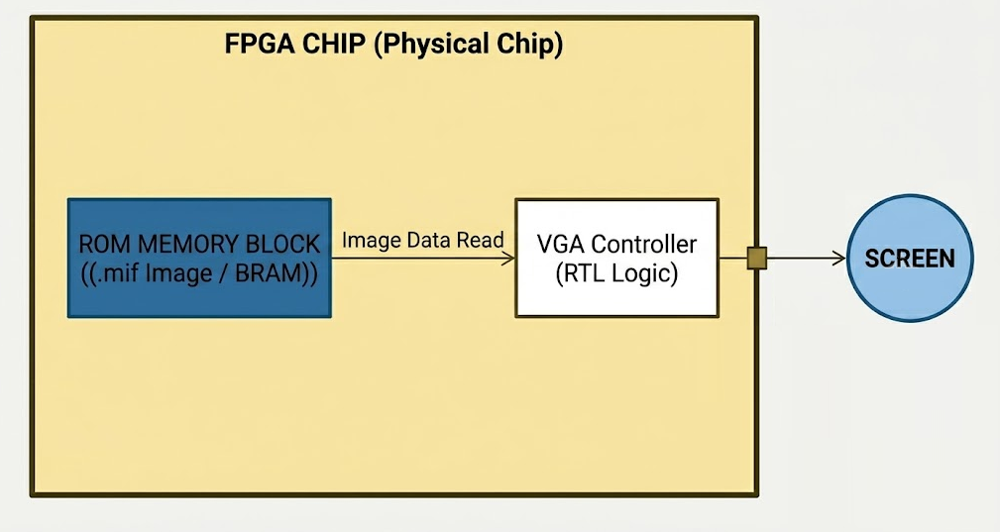
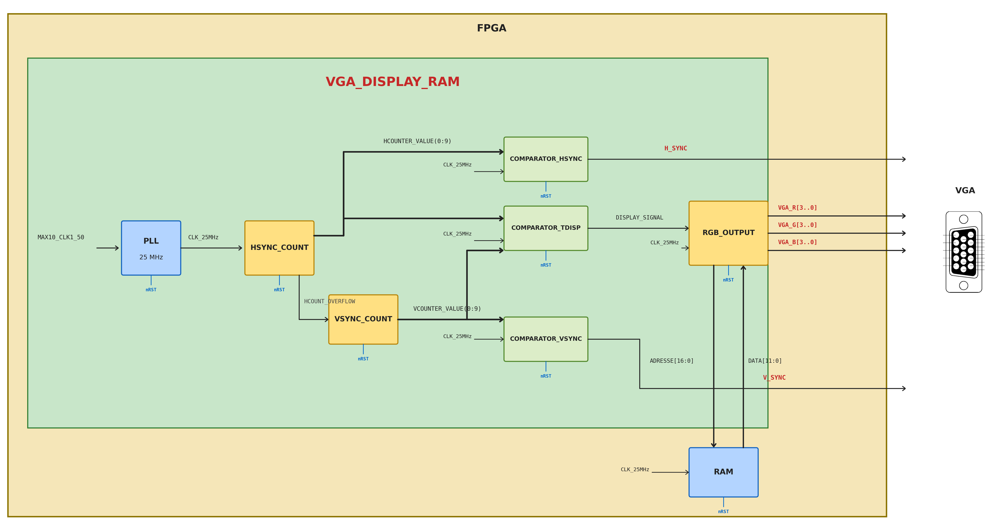

# FPGA VGA CONTROLLER

A custom VGA controller implemented in VHDL on an Intel DE10-Lite (MAX10) FPGA — displays a static image stored in internal Block RAM at 640×480 @ 60 Hz.

<p align="center">
  
</p>

---

## Overview

The goal of this project was to design a VGA controller from scratch, covering the full RTL cycle: architecture definition, VHDL implementation, simulation with testbenches, and real hardware validation.

The image is pre-processed in MATLAB, converted into a 12-bit `.mif` file, and loaded into the FPGA's internal BRAM  (Block RAM) at synthesis time.

---

## Architecture
Here is the detailed design of my architecture. A `PLL_25MHz` block derives the 25 MHz pixel clock from the on-board `MAX10_CLK1_50` oscillator, which clocks the entire controller. Two counters, `HSYNC_COUNT` and `VSYNC_COUNT`, scan the 800×524 raster and together act as the current `(X, Y)` screen coordinate: `HSYNC_COUNT` increments every clock cycle and emits `HCOUNT_OVERFLOW` at the end of each line, which in turn clocks `VSYNC_COUNT` down one line. These coordinates feed three comparators — `COMPARATOR_HSYNC`, `COMPARATOR_VSYNC`, and `COMPARATOR_TDISP` — which generate `H_SYNC`, `V_SYNC`, and the active `DISPLAY_SIGNAL` indicating when the current pixel falls inside the visible 640×480 window. The same coordinates form the `ADDRESS[15:0]` bus that addresses the on-chip RAM, initialized at synthesis from a `.mif` file containing the image. The returned `DATA[11:0]` is forwarded to `RGB_OUTPUT`, which gates it with `DISPLAY_SIGNAL` and drives `VGA_R[3:0]`, `VGA_G[3:0]`, and `VGA_B[3:0]` to the resistor-ladder DAC during the active window — and forces them to zero during blanking, as required by the VGA standard for the monitor to lock its sync.

<p align="center">
  
</p>

**Memory Management**
The image data is converted into a `.mif` file (Memory Initialization File) and mapped into the FPGA's internal RAM. A 16-bit address bus is built by concatenating the horizontal and vertical pixel counters, with an offset applied to center the 256×256 image on the 640×480 display.

**VGA Timing**
Custom timing generator producing HSYNC, VSYNC and DISPLAY_SIGNAL signals — no external IP used. Clocked at 25 MHz (derived from the 50 MHz system clock via PLL).

| | Active | Front Porch | Sync Pulse | Back Porch | Total |
|---|---|---|---|---|---|
| Horizontal | 640 | 16 | 96 | 48 | **800** |
| Vertical | 480 | 11 | 2 | 31 | **524** |

**Data Flow**
Pixel data is read synchronously from the ROM using the active display coordinates (H_count, V_count) and sent to the 12-bit resistor-ladder VGA DAC on the board.

---

## Repository Structure

```
fpga-vga-controller/
├── rtl/        # VHDL source files
├── sim/        # Simulation testbenches
├── mif/        # Memory initialization files
├── scripts/    # MATLAB image conversion script (BMP → MIF)
└── doc/        # Project report and hardware validation photos
```

## Getting Started

### Prerequisites

- **Intel Quartus Prime** <!-- QUARTUS PRIME 25.1 USED -->
- **Intel DE10-Lite** board (MAX10 `10M50DAF484C7G`)
- **MATLAB** (for regenerating the image `.mif`)
- A VGA monitor + VGA cable

### 1. Regenerate the image (optional)

The repository already ships with a generated `.mif`. To use your own image, run the MATLAB converter:

```matlab
bmp_to_mif('your_image.bmp');
```

This produces a 12-bit `.mif` (256×256) ready to be loaded into the ROM.

### 2. Build and program

```text
1. Open the project (.qpf) in Quartus Prime.
2. Run Analysis & Synthesis, then full compilation.
-- 3. make pin assignment file 
3. Connect the DE10-Lite via USB-Blaster.
4. Open the Programmer and load the bitstream onto the FPGA.
5. Connect a VGA monitor — the image appears on screen.
```


## Skills

`VHDL` · `RTL Design` · `VGA Timing` · `Block RAM / ROM` · `PLL / Clock Management` · `Testbench / Simulation` · `Intel Quartus Prime` · `MATLAB`

